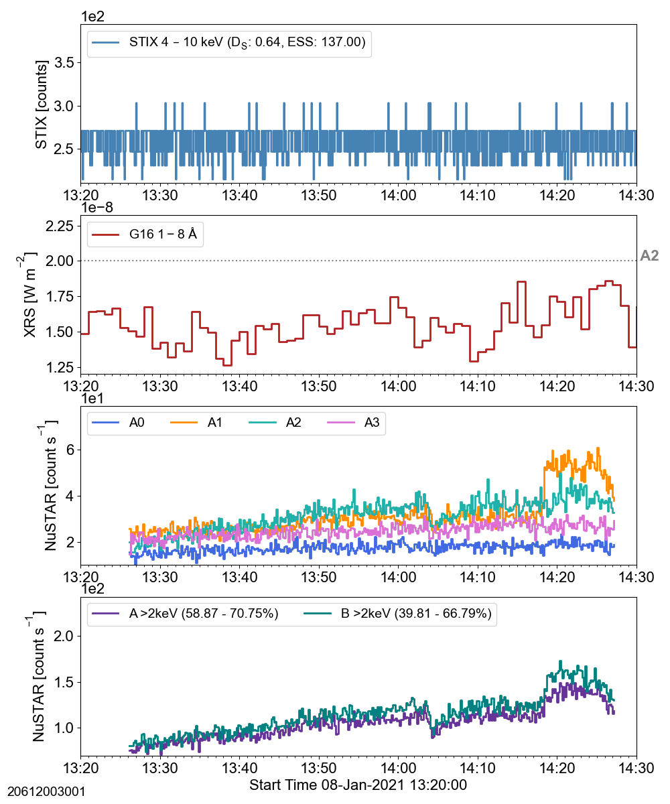
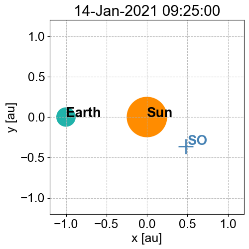

## ns_20210108
 
|  Lightcurves |  Map | Orbit |
|:---:|:---:|:---:|
||20612001001 ||
||20612002001 ||
||20612003001 ||
||20612004001 ||
||20613001001 ||
||20613002001 ||
||20613003001 ||
||20613004001 ||
||20613005001 ||
||20614001001 ||
||20614002001 ||
||20614003001 ||
