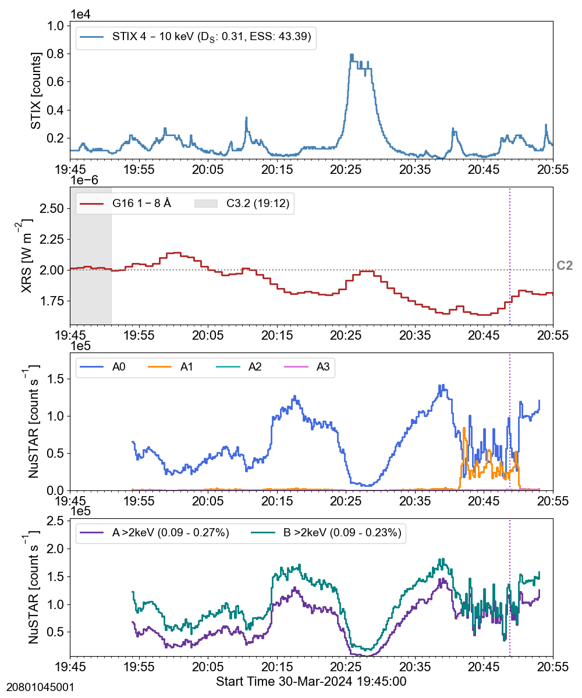

## ns_20240330
 
|  Lightcurves |  Map | Orbit |
|:---:|:---:|:---:|
||**20801041001 [hk plot](hkltc_20240330_1320_20801041001_ngs.png)** ||
||**20801042001 [hk plot](hkltc_20240330_1500_20801042001_ngs.png)** ||
||**20801043001 [hk plot](hkltc_20240330_1635_20801043001_ngs.png)** ||
||**20801044001 [hk plot](hkltc_20240330_1810_20801044001_ngs.png)** ||
||**20801045001 [hk plot](hkltc_20240330_1945_20801045001_ngs.png)** ||
||**20801048001 [hk plot](hkltc_20240331_0035_20801048001_ngs.png)** ||
||**20801049001 [hk plot](hkltc_20240331_0210_20801049001_ngs.png)** ||
