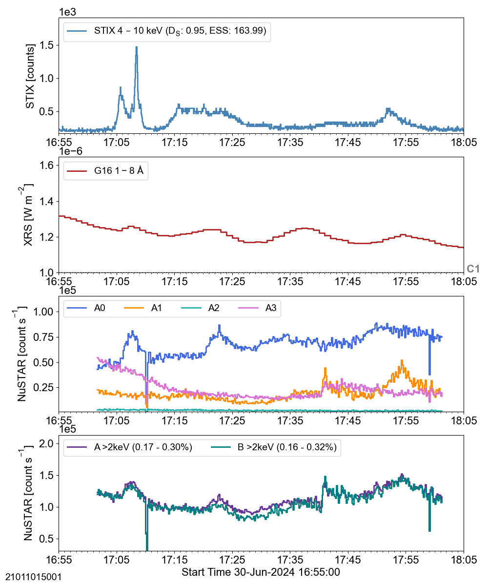
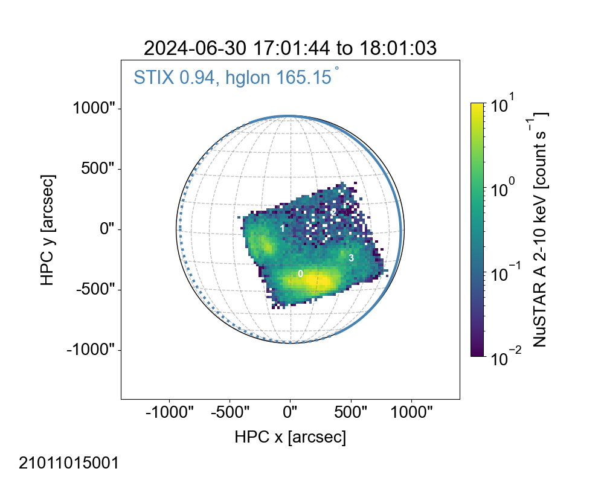
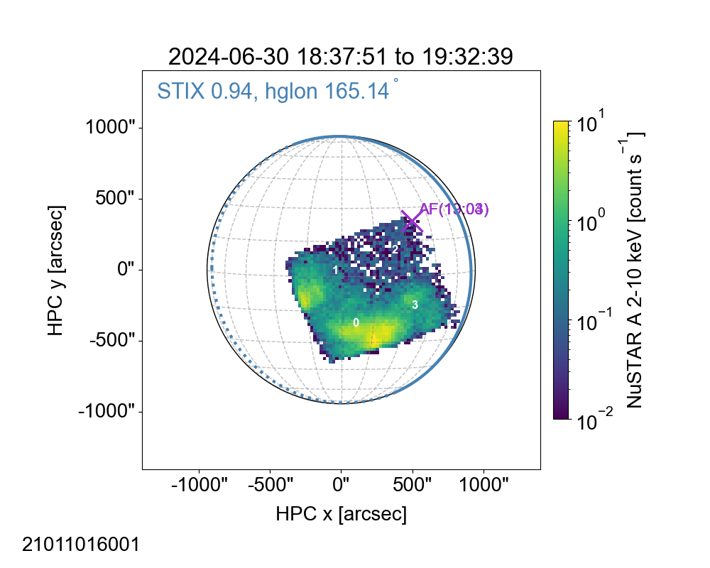
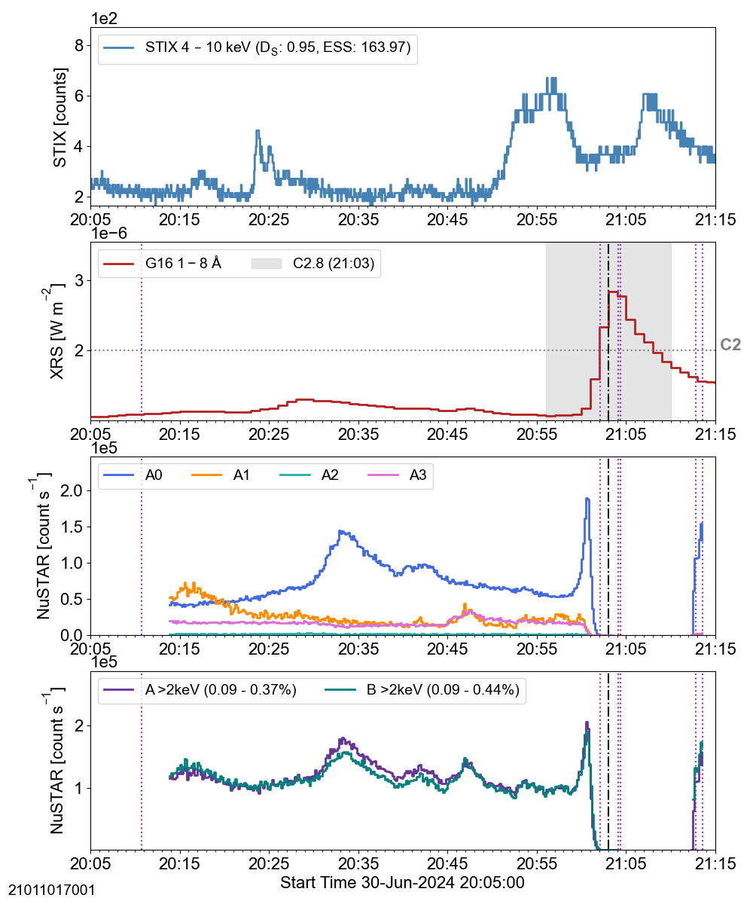
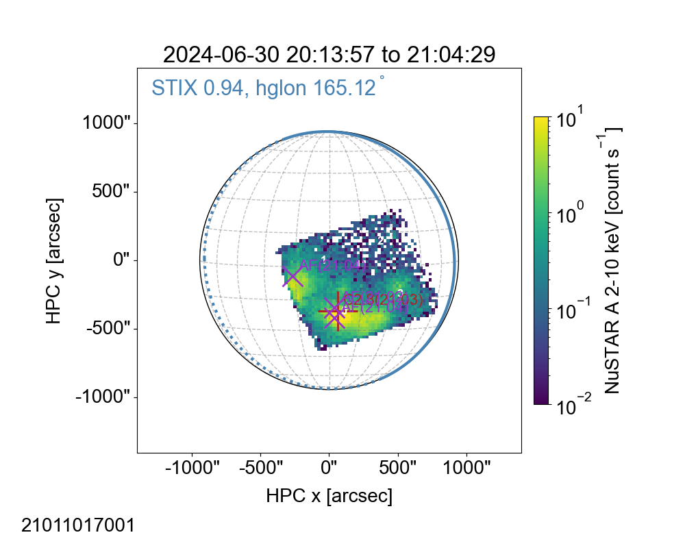

## ns_20240630
 
|  Lightcurves |  Map | Orbit |
|:---:|:---:|:---:|
||**21011015001 [hk plot](hkltc_20240630_1655_21011015001_ngs.png)** ||
||**21011016001 [hk plot](hkltc_20240630_1830_21011016001_ngs.png)** ||
||**21011017001 [hk plot](hkltc_20240630_2005_21011017001_ngs.png)** ||
