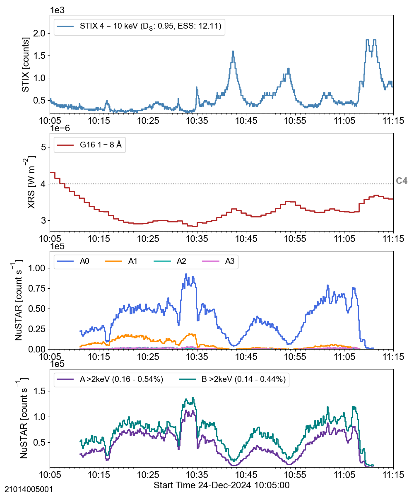
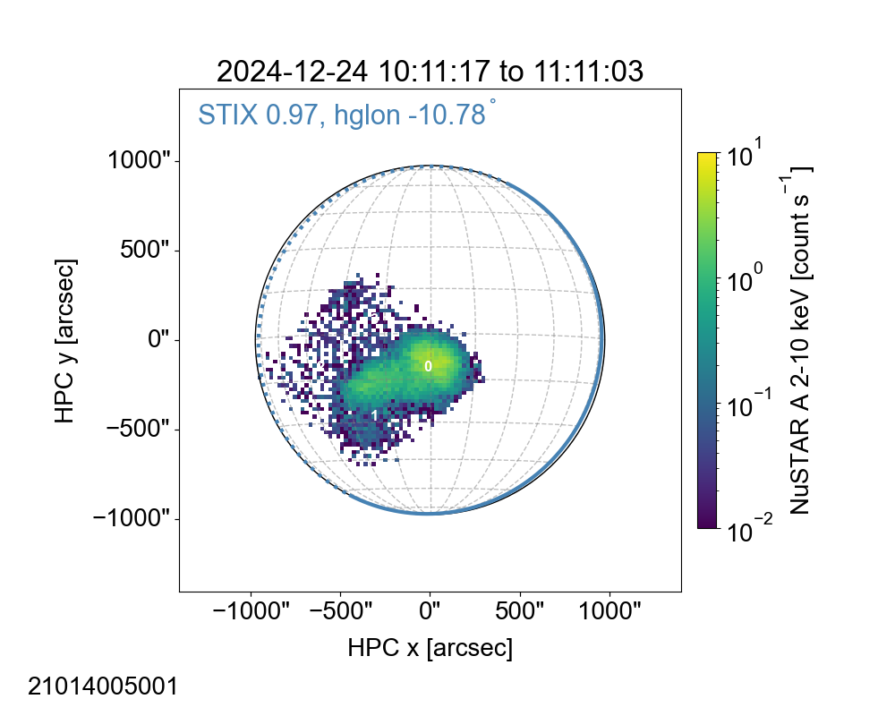
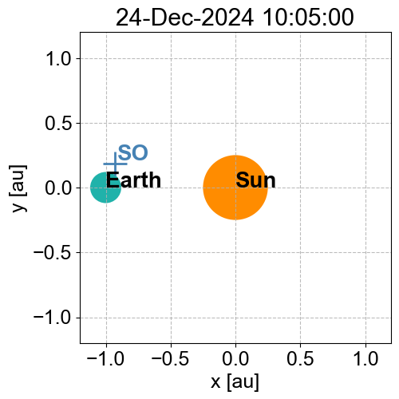
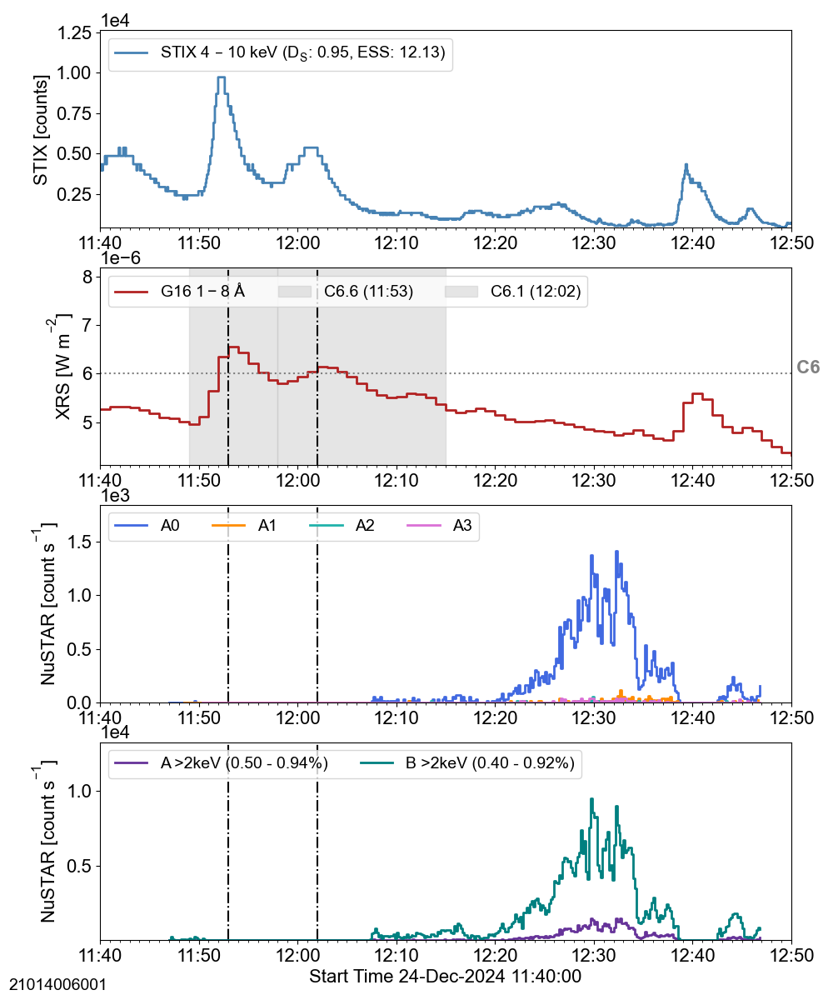
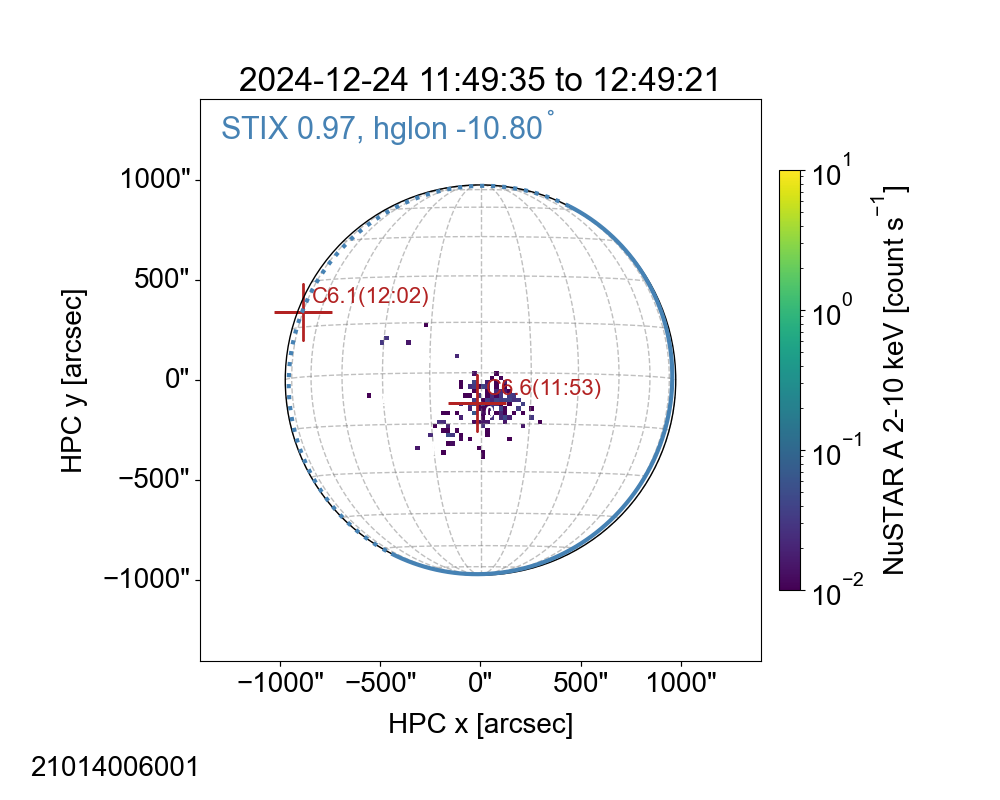
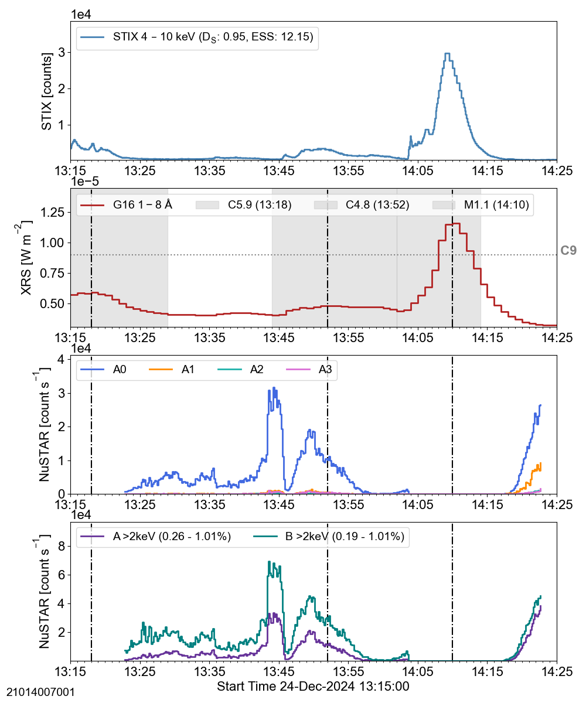
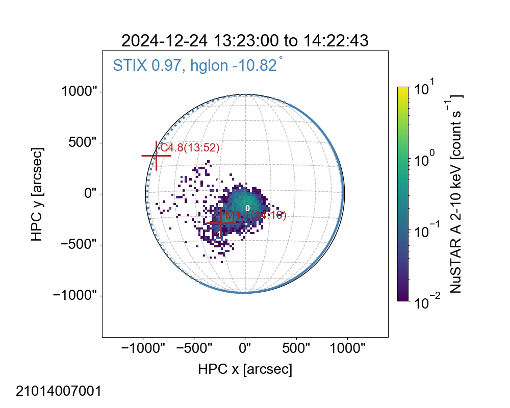
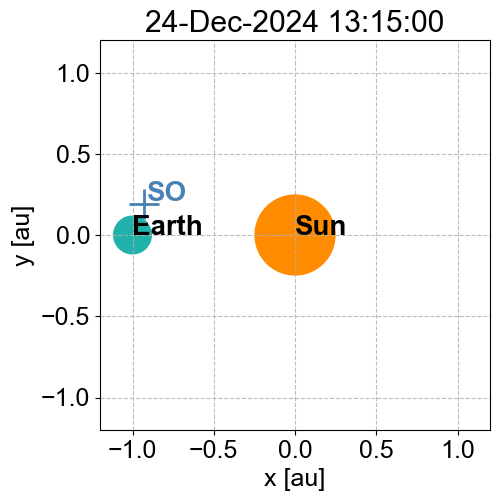
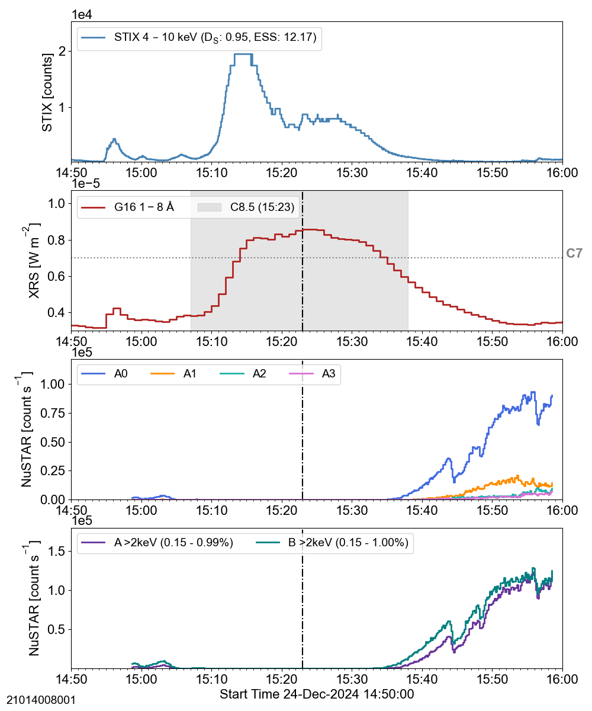
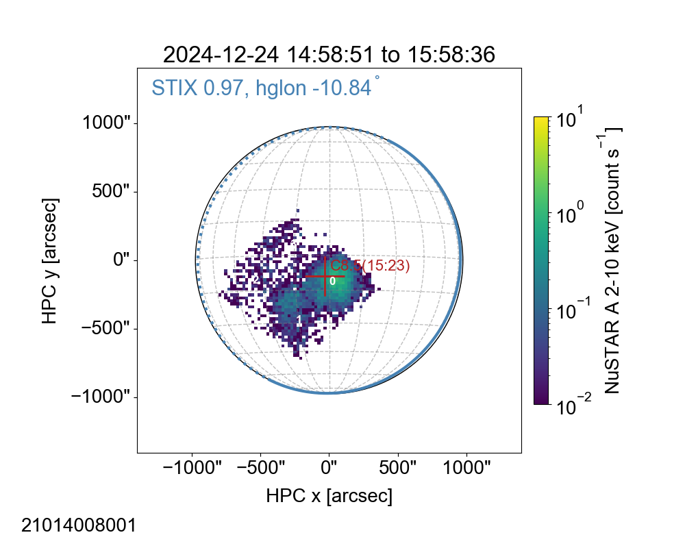

## ns_20241224
 
|  Lightcurves |  Map | Orbit |
|:---:|:---:|:---:|
||**21014005001 [hk plot](hkltc_20241224_1005_21014005001_ngs.png)** ||
||**21014006001 [hk plot](hkltc_20241224_1140_21014006001_ngs.png)** ||
||**21014007001 [hk plot](hkltc_20241224_1315_21014007001_ngs.png)** ||
||**21014008001 [hk plot](hkltc_20241224_1450_21014008001_ngs.png)** ||
